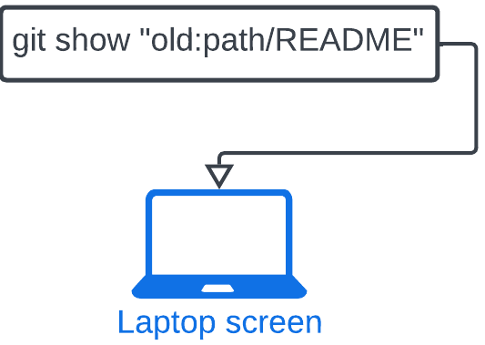
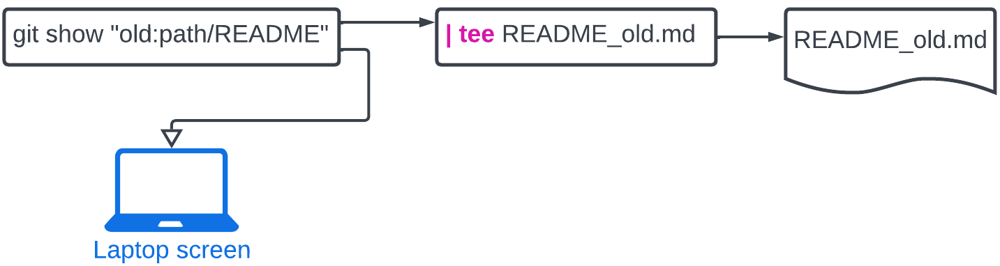

# View an older version of your README.md
## Introduction

See an older version of your README.md using `git show`


## Goals

- Save full versions of older READMEs
- Learn Linux `tee` send the output to the screen **and** a file
- Learn Linux `diff`


# Walkthrough
### Get a list of your commit logs and hashes (ids)
#### Command
```
$ git log --oneline -- README.md
```

#### Command and output
```
$ git log --oneline -- README.md
b95796e 4. Added copyright
67c1380 3. Added abstract
b034503 2. Added description
23fa03a 1. First draft: Added title
```

### Use `git show hash:full_repo_path` to view old version

### Get the README.md of the first draft
#### Command
```
# 23fa03a 1. First draft: Added title

$ git show 23fa03a:projects/dvklopfenstein/README.md
```

#### Command and output

```
$ git show 23fa03a:projects/dvklopfenstein/README.md
# DVK's Project
```


### Get the README.md where the abstract was added
#### Command
```
# 67c1380 3. Added abstract

$ git show 67c1380:projects/dvklopfenstein/README.md
```

#### Command and output
```
$ git show 67c1380:projects/dvklopfenstein/README.md
# DVK's Project
My description ...

# Abstract
Lorem ipsum dolor sit amet, consectetur adipiscing elit, sed do eiusmod tempor
incididunt ut labore et dolore magna aliqua. Ut enim ad minim veniam, quis
nostrud exercitation ullamco laboris nisi ut aliquip ex ea commodo consequat.
Duis aute irure dolor in reprehenderit in voluptate velit esse cillum dolore eu
fugiat nulla pariatur. Excepteur sint occaecat cupidatat non proident, sunt in
culpa qui officia deserunt mollit anim id est laborum.
```

### Save the README.md of the first draft

#### Command
```
# 23fa03a 1. First draft: Added title

$ git show 23fa03a:projects/dvklopfenstein/README.md | tee 01_README_23fa03a.md
$ ls -l 01_README_23fa03a.md
```

#### Command and output
```
$ git show 23fa03a:projects/dvklopfenstein/README.md | tee 01_README_23fa03a.md
# DVK's Project

$ ls -l 01_README_23fa03a.md
-rw-r--r--+ 1 dvklo dvklo 16 Aug 28 23:03 01_README_23fa03a.md
```


### Get the README.md where the abstract was added
#### Command
```
# 67c1380 3. Added abstract

$ git show 67c1380:projects/dvklopfenstein/README.md | tee 03_README_67c1380.md
$ ls -l !$
```

#### Command and output
```
$  git show 67c1380:projects/dvklopfenstein/README.md | tee 03_README_67c1380.md
# DVK's Project
My description ...

# Abstract
Lorem ipsum dolor sit amet, consectetur adipiscing elit, sed do eiusmod tempor
incididunt ut labore et dolore magna aliqua. Ut enim ad minim veniam, quis
nostrud exercitation ullamco laboris nisi ut aliquip ex ea commodo consequat.
Duis aute irure dolor in reprehenderit in voluptate velit esse cillum dolore eu
fugiat nulla pariatur. Excepteur sint occaecat cupidatat non proident, sunt in
culpa qui officia deserunt mollit anim id est laborum.


$ ls -l !$
ls -l 03_README_67c1380.md
-rw-r--r--+ 1 dvklo dvklo 494 Aug 28 23:05 03_README_67c1380.md
```

### Find the difference between the two files in Linux
#### Command
```
67c1380 3. Added abstract
b034503 2. Added description
23fa03a 1. First draft: Added title

$ diff 01_README_23fa03a.md 03_README_67c1380.md
```

#### Command and output
Notice that **both** the description and the abstract are in the newer version
```
$ diff 01_README_23fa03a.md 03_README_67c1380.md
1a2,11
> My description ...
>
> # Abstract
> Lorem ipsum dolor sit amet, consectetur adipiscing elit, sed do eiusmod tempor
> incididunt ut labore et dolore magna aliqua. Ut enim ad minim veniam, quis
> nostrud exercitation ullamco laboris nisi ut aliquip ex ea commodo consequat.
> Duis aute irure dolor in reprehenderit in voluptate velit esse cillum dolore eu
> fugiat nulla pariatur. Excepteur sint occaecat cupidatat non proident, sunt in
> culpa qui officia deserunt mollit anim id est laborum.
>
```

Copyright (C) 2023-present, Drexel Medicine. All rights reserved
