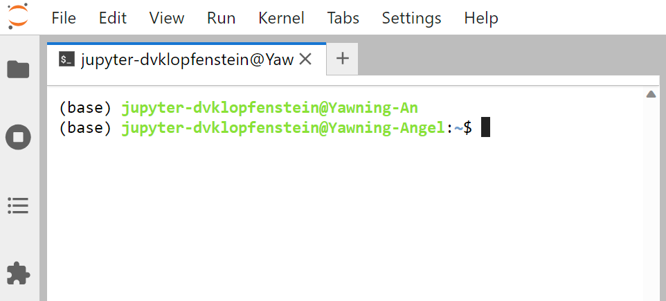
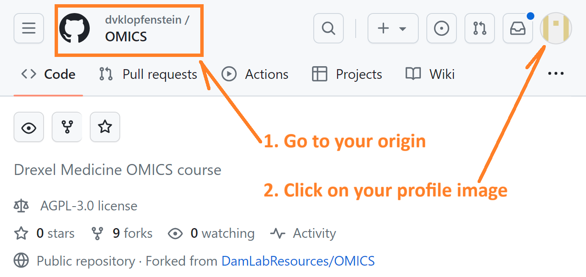
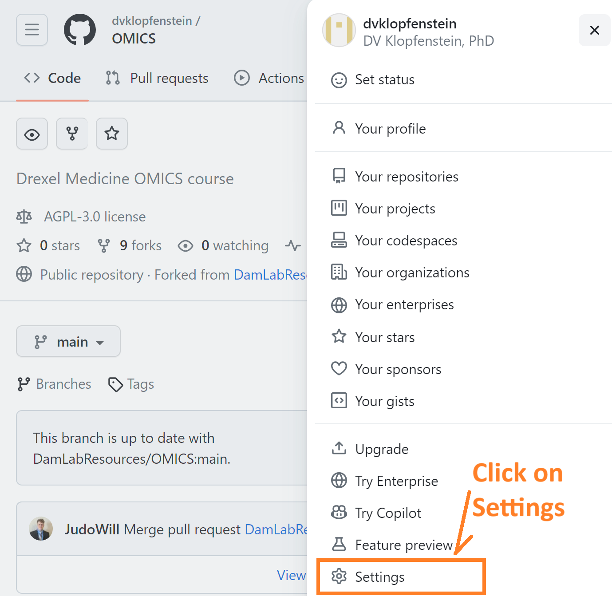
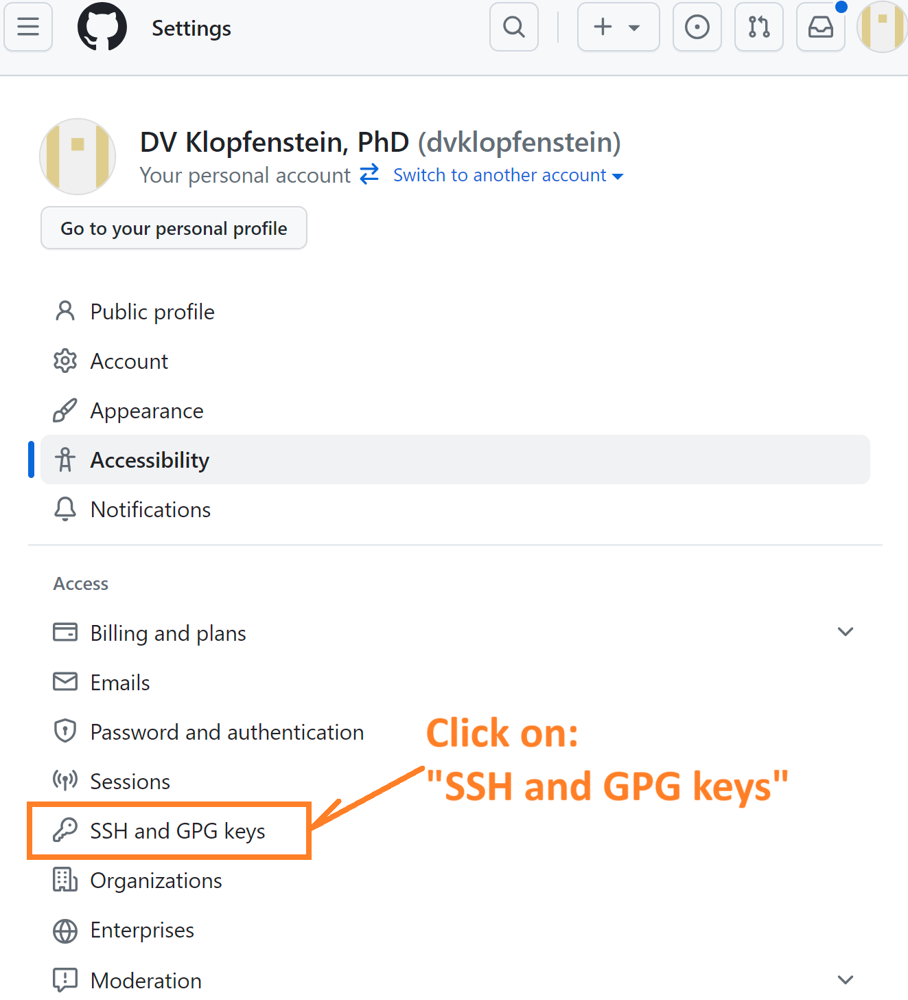
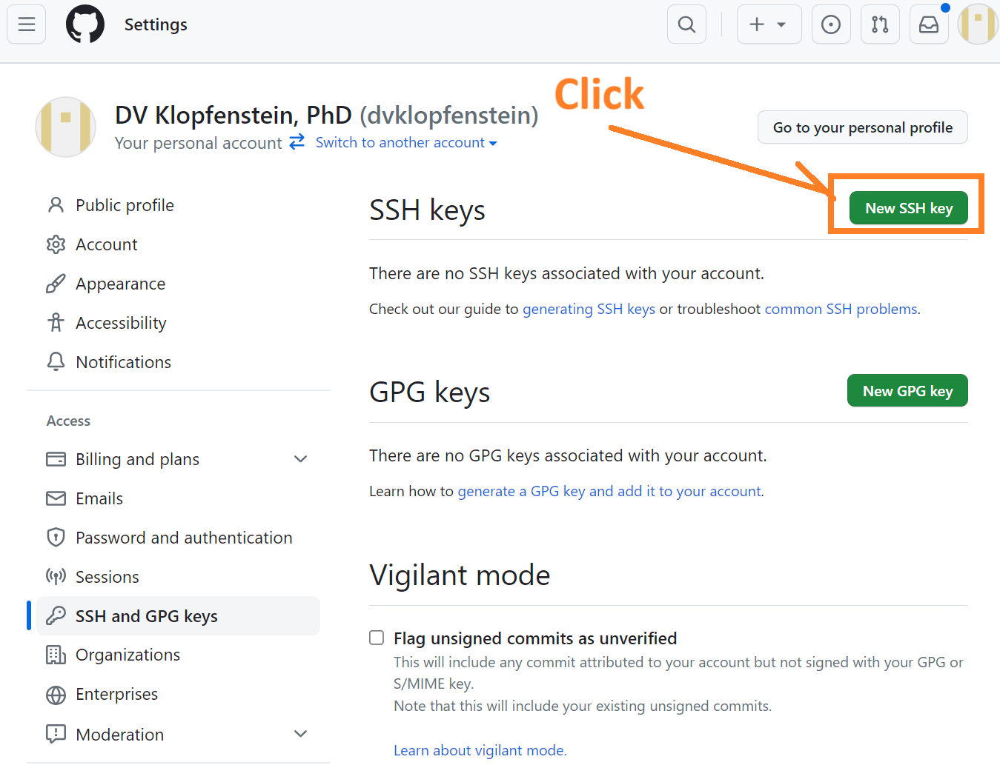
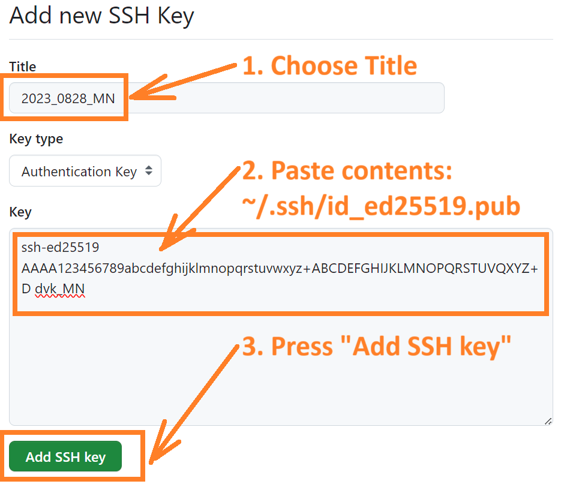
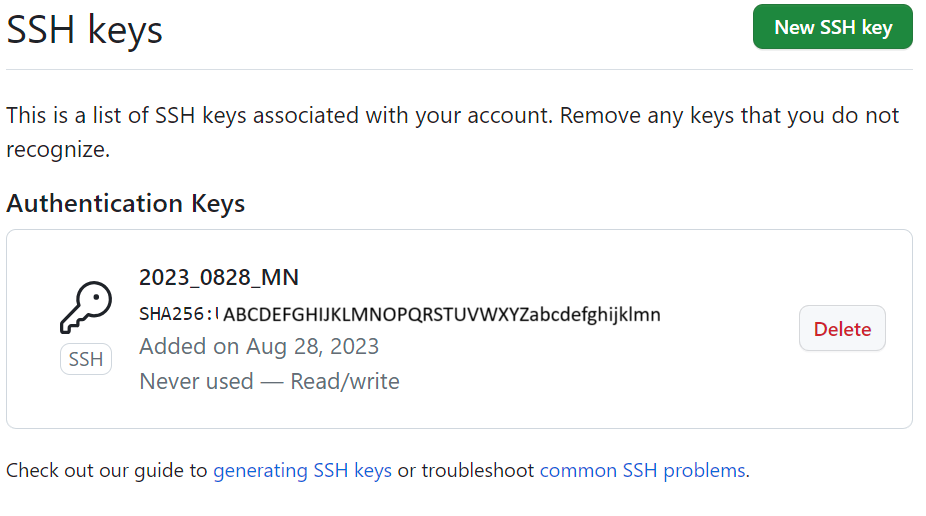
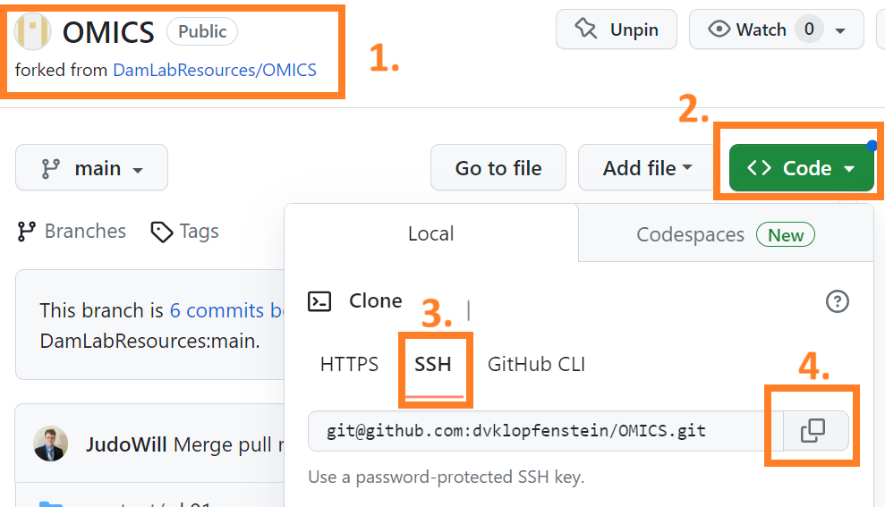

# Do your first commit, push, and pull request

* [Get a SSH (Secure Shell Protocol) key](#add-an-ssh-key-to-your-github-account), which is needed to `commit` your work from `local` to `origin`
* [Linux bash args](#linux-bash-args)

# Add an SSH key to your GitHub account

* [**1. Open your JupyterHub terminal**](#1-open-your-jupyterhub-terminal)
* [**2. Generate a new SSH key**](#2-generate-a-new-ssh-key-in-your-terminal-window) onto your JupyterHub account
* [**3. Add your SSH key to your GitHub account**](#3-add-your-ssh-key-to-your-github-account)
* [**4. Ensure remote, `origin`, is set to SSH remote**](#4-ensure-remote-origin-is-set-to-ssh-remote)
* [**Notes:**](#notes)
  * [`$ git config pull.rebase true`]()


## Helpful Links
* [Generating a new SSH key and adding to the ssh-agent](https://docs.github.com/en/authentication/connecting-to-github-with-ssh/generating-a-new-ssh-key-and-adding-it-to-the-ssh-agent)

## 1. Open your JupyterHub terminal
* In your browser, go to the server named MistakeNot: [**`http://10.11.19.48/`**](http://10.11.19.48)
* Open the terminal window by clicking on the menu: **File -> New -> Terminal**

* The terminal window appears:


## 2. Generate a new SSH key in your terminal window
### 2a. Generate a new SSH key
```
$ ssh-keygen -t ed25519 -C "your_email@example.com"
```
* `-t type_of_key`
* `-C comment`

If you do not want a passphrase, press the [enter] button when prompted:
`Enter passphrase (empty for no passphrase):`

You will see:
```
$ ssh-keygen -t ed25519 -C dvk_MN
Generating public/private ed25519 key pair.
Enter file in which to save the key (/home/jupyter-abc/.ssh/id_ed25519): 
Created directory '/home/jupyter-abc/.ssh'.
Enter passphrase (empty for no passphrase): 
Enter same passphrase again: jk
Your identification has been saved in /home/jupyter-abc/.ssh/id_ed25519
Your public key has been saved in /home/jupyter-abc/.ssh/id_ed25519.pub
The key fingerprint is:
SHA256:f8iFCF1WM+SdLwtCHOuSqScCh4xbA59klU7NxKKi14M dvk_MN
The key's randomart image is:
+--[ED25519 256]--+
|    .*.   +o=    |
|   .+ +. + + + . |
|. o+ .. . + . o  |
|.B.o.  . * .   . |
|o.Oo.   S + o . .|
|.oE+o  . + + . o |
|..  ..o . + . .  |
|     . o   .     |
|                 |
+----[SHA256]-----+
```
### 2b. Look at the permissions on your SSH key
Your permissions should be `-rw-------`
```
$ ls -lrt ~/.ssh/id_ed25519
-rw------- 1 jupyter-abc jupyter-abc 387 Aug 28 14:27 /home/jupyter-abc/.ssh/id_ed25519
```
If your permissions are not `-rw-------`, do this:
```
chmod 600 /home/jupyter-abc/.ssh/id_ed25519.pub

```

### 2c. Start the ssh-agent in the background
```
$ eval "$(ssh-agent -s)"
Agent pid 1234567
```

### 2d. Add your SSH private key to the ssh-agent
```
$ ssh-add ~/.ssh/id_ed25519
Identity added: /home/jupyter-abc/.ssh/id_ed25519 (dvk_MN)
```

### 2e. Copy the contents of the id_ed25519.pub file to your clipboard
#### Open the file
```
$ nano ~/.ssh/id_ed25519.pub
```
#### Copy the contents
Select the line and press CTRL-C to copy
```
ssh-ed25519 AAAA123456789abcdefghijklmnopqrstuvwxyz+ABCDEFGHIJKLMNOPQRSTUVQXYZ+D dvk_MN
```

## 3. Add your SSH key to your GitHub account

### 3a. Go to your origin in your browser
`https://github.com/mygitlogin/OMICS`

Then click on your profile icon/image to open the profile menu    


### 3b. Click on "Settings"


### 3c. Click on "SSH and GPG keys"


### 3d. Click on "New SSH key"


### 3e. Add a name to your SSH key and press "Add SSH key"


#### You will see:


## 4. Ensure remote, **`origin`** is set to SSH remote:
### 4a. Check your remotes:
```
$ cd ~/repos/OMICS
$ git remote -v
origin 	https://github.com/mygitlogin/OMICS.git (fetch)
origin 	https://github.com/mygitlogin/OMICS.git (push)
```

### 4b. Rename your http remote to make space for the SSH remote
```
$ git remote remove origin
Renaming remote references: 100% (4/4), done.

$ git remote -v
```

### 4c. Copy GitHub SSH address

1. Go to origin on GitHub
2. Click on the "Code" button
3. Click on "SSH"
4. Click on the double-box copy button



### 4d. Add remote, **`origin`**, as SSH-style
```
$ git remote add origin git@github.com:mygitlogin/OMICS.git

$ git remote -v
origin 	git@github.com:mygitlogin/OMICS.git (fetch)
origin 	git@github.com:mygitlogin/OMICS.git (push)
```

### 5. Do: `git push`
```
$ cd ~/repos/OMICS/

$ find projects
projects
projects/README.md
projects/mygitlogin
projects/mygitlogin/README.md

$ cd projects/mygitlogin
```

#### Make a change to your project README.md
```
$ nano README.md
```

#### Commit your changed README.md
```
$ git commit README.md -m 'Added hello line'
```

#### Push your committed changes to origin
```
$ git push
fatal: The current branch main has no upstream branch.
To push the current branch and set the remote as upstream, use

    git push --set-upstream origin main

$ git push --set-upstream origin main
Counting objects: 100% (14/14), done.
Delta compression using up to 20 threads
Compressing objects: 100% (6/6), done.
Writing objects: 100% (10/10), 828 bytes | 414.00 KiB/s, done.
Total 10 (delta 2), reused 0 (delta 0), pack-reused 0
remote: Resolving deltas: 100% (2/2), completed with 1 local object.
To github.com:dvklopfenstein/OMICS.git
   f08fa14..9aeb590  main -> main
branch 'main' set up to track 'origin/main'.
```

#### Change your file again, commit, and push
You are up-to-dat
```
$ git status
On branch main
Your branch is up to date with 'origin/main'.

nothing to commit, working tree clean
```


## Notes:
### Configure your email and name in git
#### Do this:
```
$ git config --global user.email mygitlogin@users.noreply.github.com
$ git config --global user.name "yourdesiredname"
```
#### If you see this:    
```
$ git commit -a -m 'Add SSH wk02 content'
Author identity unknown

*** Please tell me who you are.

Run

  git config --global user.email "you@example.com"
  git config --global user.name "Your Name"

to set your account's default identity.
Omit --global to set the identity only in this repository.

fatal: unable to auto-detect email address (got 'jupyter-abc@Mistake-Not.(none)')
```

### Configure git pull to rebase
```
```
t push
#### Do this:    
```
$ git config pull.rebase true
```

#### If you see this:    
```
hint: You have divergent branches and need to specify how to reconcile them.
hint: You can do so by running one of the following commands sometime before
hint: your next pull:
hint:
hint:   git config pull.rebase false  # merge
hint:   git config pull.rebase true   # rebase
hint:   git config pull.ff only       # fast-forward only
hint:
hint: You can replace "git config" with "git config --global" to set a default
hint: preference for all repositories. You can also pass --rebase, --no-rebase,
hint: or --ff-only on the command line to override the configured default per
hint: invocation.
```

### If your `push` hangs:
Restart your ssh agent, if your `push` hangs:
```
killall ssh-agent; eval `ssh-agent`
```

If you see your `push` hanging:
```
$ git push origin dvk
Enter passphrase for key '/home/dvklo/.ssh/id_ed25519':
Enumerating objects: 18, done.
Counting objects: 100% (18/18), done.
Delta compression using up to 20 threads
Compressing objects: 100% (14/14), done.
Writing objects: 100% (15/15), 525.89 KiB | 4.21 MiB/s, done.
Total 15 (delta 2), reused 0 (delta 0), pack-reused 0
```


# Linux bash args

## Add an `h` alias to `history` 

Copyright (C) 2023-present, Drexel Medicine. All rights reserved.
