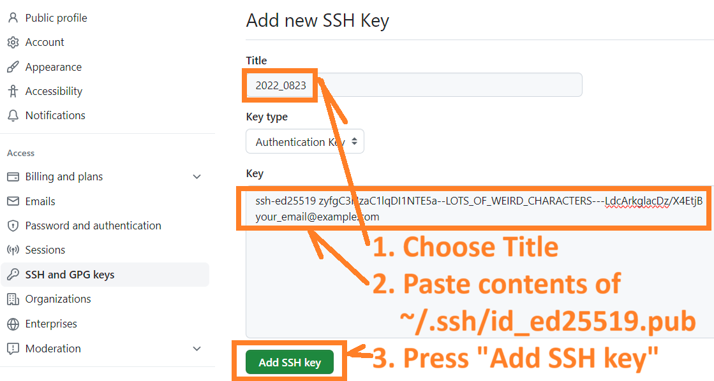

# Do your first commit, push, and pull request

* [Get a SSH (Secure Shell Protocol) key](#add-an-ssh-key-to-your-github-account), which is needed to `commit` your work from `local` to `origin`
* [Linux bash args](#linux-bash-args)

# Add an SSH key to your GitHub account

* [**1. Open your JupyterHub terminal**](#1-open-your-jupyterhub-terminal)
* [**2. Generate a new SSH key**](#1-generate-a-new-ssh-key) onto your JupyterHub account
* [**3. Add your SSH key to your GitHub account**](#3-add-your-ssh-key-to-your-github-account)
* [**4. Ensure remote, **`origin`** is set to SSH remote]()

## Helpful Links
* [Generating a new SSH key and adding to the ssh-agent](https://docs.github.com/en/authentication/connecting-to-github-with-ssh/generating-a-new-ssh-key-and-adding-it-to-the-ssh-agent)

## 1. Open your JupyterHub terminal
In your browser, go to [**`http://10.11.19.24/`**](http://10.11.19.24)

Open the terminal window by clicking on the menu:
**File -> New -> Terminal**


## 2. Generate a new SSH key
In your new terminal window, enter these Liunx commands to generate a new SSH key
which will stored in your home (`~`) directory.

### 2a. Generate a new SSH key
You will be asked if you would like to enter a pass phrase (password).
You can choose to enter no password associated with your key if you like.
```
$ ssh-keygen -t ed25519 -C "your_email@example.com"
```
### 2b. Look at the permissions on your SSH key
Your permissions should be `-rw-------`
```
$ ls -lrt ~/.ssh/id_ed25519
-rw------- 1 dvklo dvklo 464 Aug 23 16:15 /home/dvklo/.ssh/id_ed25519
```
If your permissions are not `-rw-------`, do this:
```
chmod 600 /home/dvklo/.ssh/id_ed25519.pub
```

### 2c. Start the ssh-agent in the background
```
$ eval "$(ssh-agent -s)"
```

### 2d. Add your SSH private key to the ssh-agent
```
$ ssh-add ~/.ssh/id_ed25519
```

### 2e. Copy the contents of the id_ed25519.pub file to your clipboard
```
$ clip < ~/.ssh/id_ed25519.pub
```

## 3. Add your SSH key to your GitHub account

### 3a. Go to your origin in your browser
`https://github.com/yourgitlogin/OMICS`

Then click on your profile icon/image to open the profile menu    


### 3b. Click on "Settings"


### 3c. Click on "SSH and GPG keys"


### 3d. Click on "New SSH key"


### 3e. Add a name to your SSH key and press "Add SSH key"


## 4. Ensure remote, **`origin`** is set to SSH remote:
### 4a. Check your remotes:
```
$ git remote -v
origin 	https://github.com/dvklopfenstein/OMICS.git (fetch)
origin 	https://github.com/dvklopfenstein/OMICS.git (push)
```

### 4b. Rename your http remote to make space for the SSH remote
```
$ git remote rename origin origin_https
Renaming remote references: 100% (4/4), done.

$ git remote -v
origin_https    	https://github.com/dvklopfenstein/OMICS.git (fetch)
origin_https    	https://github.com/dvklopfenstein/OMICS.git (push)
```

### 4c. Add remote, **`origin`** as SSH-style
```
$ git remote add origin git@github.com:dvklopfenstein/OMICS.git

$ git remote -v
origin 	git@github.com:dvklopfenstein/OMICS.git (fetch)
origin 	git@github.com:dvklopfenstein/OMICS.git (push)
origin_https    	https://github.com/dvklopfenstein/OMICS.git (fetch)
origin_https    	https://github.com/dvklopfenstein/OMICS.git (push)
```


# Linux bash args

## Add an `h` alias to `history` 

Copyright (C) 2023-present, Drexel Medicine. All rights reserved.
